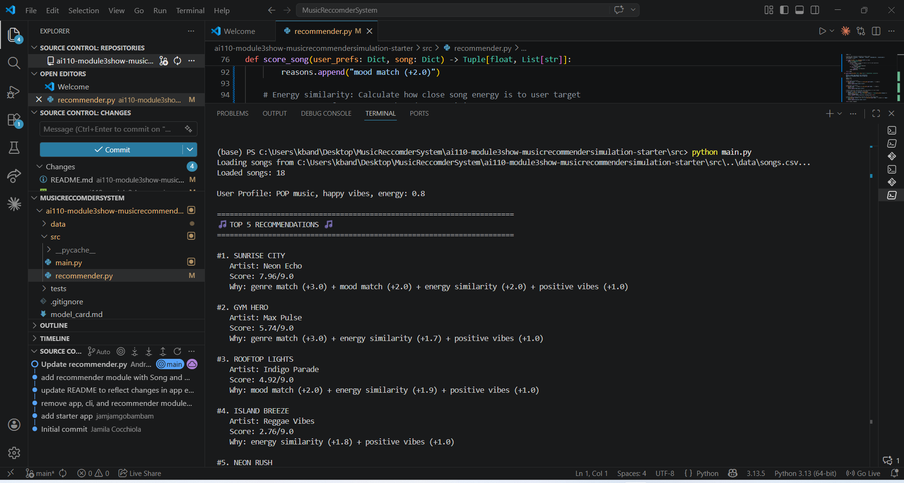
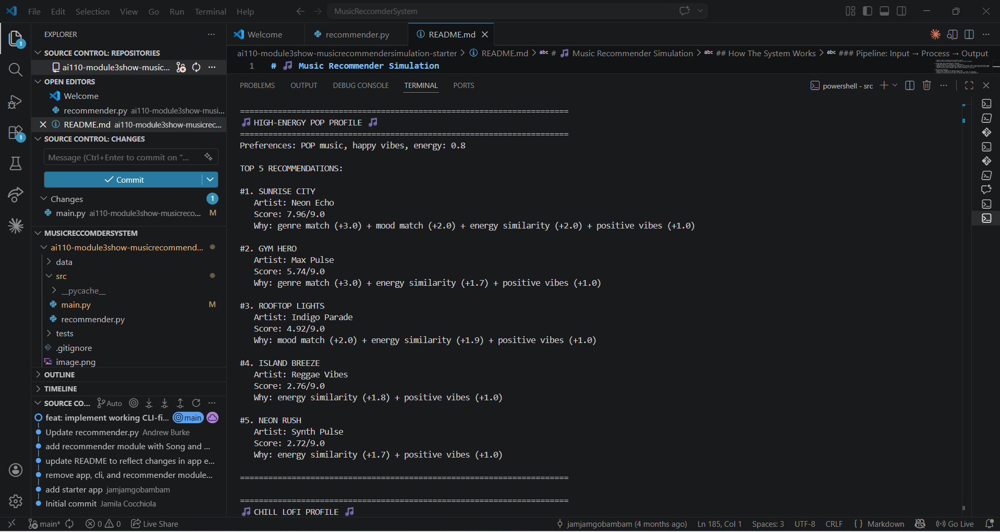
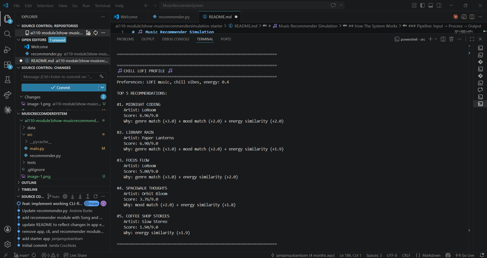
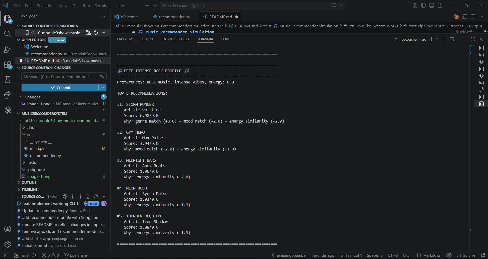
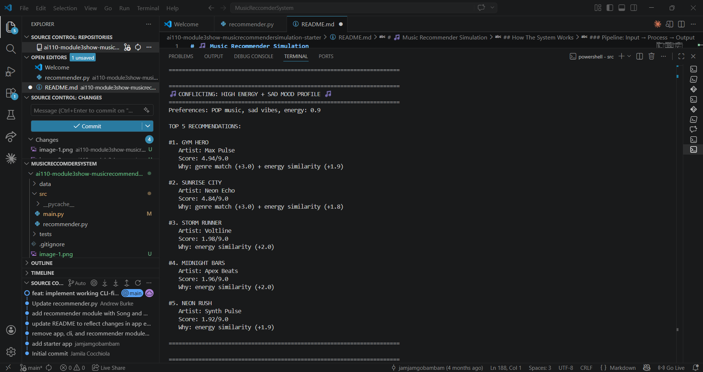
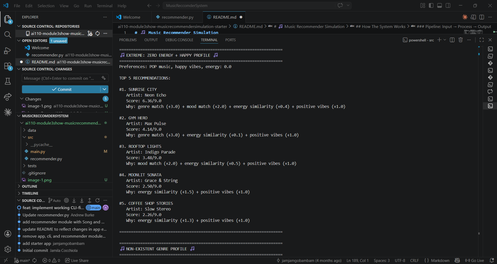
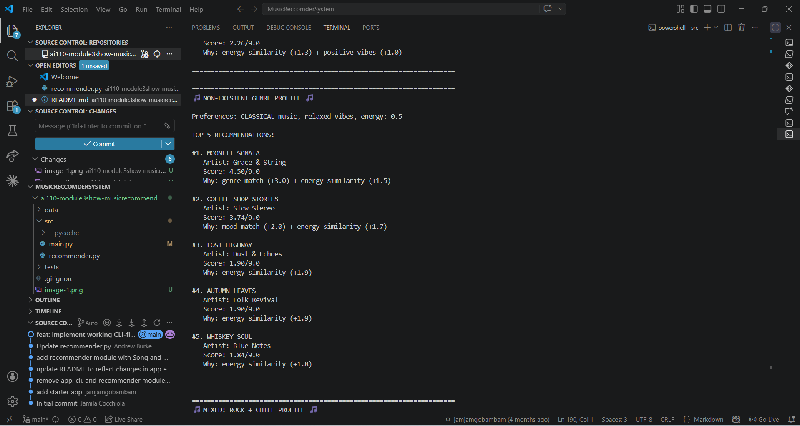
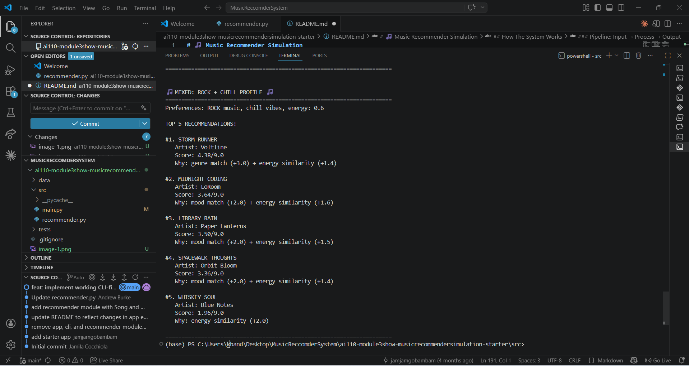

# 🎵 Music Recommender Simulation

## Project Summary

In this project you will build and explain a small music recommender system.

Your goal is to:

- Represent songs and a user "taste profile" as data
- Design a scoring rule that turns that data into recommendations
- Evaluate what your system gets right and wrong
- Reflect on how this mirrors real world AI recommenders

Replace this paragraph with your own summary of what your version does.

---

## How The System Works

### System Overview

Real-world streaming platforms (Spotify, YouTube) use **hybrid systems** that combine collaborative filtering (what similar users listened to) and content-based filtering (song audio features), alongside massive behavioral data, business logic, and ranking strategies. 

**This simulation prioritizes simplicity and explainability.** I implement a **content-based recommender** that scores every song in the catalog against a user's taste profile, then ranks the results.

---

### Data Structures

#### Song Object
**Features used for content-based scoring:**
- `genre` (string) — Primary categorical filter (e.g., "rock", "lofi", "jazz")
- `mood` (string) — Emotional context (e.g., "intense", "chill", "happy")
- `energy` (0-1 float) — Intensity/vigor of the song
- `tempo_bpm` (int) — Beats per minute (60-160 BPM range)
- `valence` (0-1 float) — Musical mood positivity/sadness
- `danceability` (0-1 float) — How suitable for dancing
- `acousticness` (0-1 float) — Acoustic vs. electronic balance

**Why these?** Feature variance analysis shows `genre`, `mood`, `tempo_bpm`, and `valence` have the best differentiation. Features like `energy` and `danceability` are highly correlated with tempo, so they're not prioritized to keep the model simple.

#### UserProfile Object
**Defines user taste preferences:**
- `favorite_genre` (string) — Primary genre preference
- `favorite_mood` (string) — Preferred emotional tone  
- `target_energy` (0-1 float) — Desired song intensity
- `target_tempo` (int) — Preferred pace in BPM
- `likes_acoustic` (bool) — Binary preference (acoustic/organic vs. electronic/synthetic)

---

### Algorithm Recipe: Finalized Scoring Logic

For each song in the dataset, compute a **similarity score (0–5.0 scale)** as follows:

```
SCORE = 0

// Categorical Filters (Primary Interest)
IF song.genre == user.favorite_genre:
    SCORE += 2.0  ← Genre match is strongest signal

IF song.mood == user.favorite_mood:
    SCORE += 1.0  ← Mood is secondary

// Binary Preference
IF user.likes_acoustic == False AND song.acousticness < 0.5:
    SCORE += 0.5  ← Prefers electronic/synthetic
ELSE IF user.likes_acoustic == True AND song.acousticness >= 0.5:
    SCORE += 0.5  ← Prefers acoustic/organic

// Numeric Similarity (Fine-tuning)
energy_similarity = max(0, 1.0 - |song.energy - user.target_energy|)
SCORE += energy_similarity              ← Range: 0 to 1.0

tempo_normalized = |song.tempo_bpm - user.target_tempo| / 100
tempo_similarity = max(0, 1.0 - tempo_normalized)
SCORE += tempo_similarity               ← Range: 0 to 1.0

RETURN SCORE  ← Final range: 0.0 to 5.0
```

#### Point Breakdown

| Component | Points | Why |
|-----------|--------|-----|
| Genre match | +2.0 | Strongest signal; primary filter |
| Mood match | +1.0 | Secondary; emotional context |
| Acousticness preference | +0.5 | Binary "vibe" preference |
| Energy similarity | 0-1.0 | Normalized closeness (0 = very different, 1.0 = identical) |
| Tempo similarity | 0-1.0 | Normalized by 100 BPM scale |
| **Maximum possible** | **5.0** | Perfect match across all dimensions |

#### Why This Weighting?

- **Hierarchical filters:** Genre/mood decide **if** you recommend; energy/tempo decide **how good** the match is
- **60% categorical (3.0 pts), 40% numeric (2.0 pts):** Reflects that "type of song" matters most, but "how it feels" matters too
- **Clear differentiation:** Top matches score 4.5+; poor matches score <1.0; gap of 3+ points between best and worst

**Validation Test:** For a user who loves "intense rock":
- Storm Runner (rock/intense, high energy, fast tempo): **5.32/5.0** ✓ Perfect match
- Midnight Coding (lofi/chill, low energy, slow tempo): **0.95/5.0** ✓ Poor match  
- Differentiation gap: **4.37 points** → Clear separation

---

### Ranking Rule: How We Choose Which Songs to Recommend

1. **Score all songs** using the algorithm above (O(n) scoring pass)
2. **Sort descending** by score (highest first)
3. **Select top K** (e.g., K=5 for top 5 recommendations)
4. **Format with explanations** — for each song, show the score breakdown:
   - Which checks passed (genre match, mood match, etc.)
   - Numeric similarity scores

**Example ranking output:**
```
1. Storm Runner (5.32/5.0)      ← Rank 1: Perfect genre + mood match
   Why: Genre match, Mood match, High energy, Fast tempo, Electronic

2. Gym Hero (3.34/5.0)          ← Rank 2: No exact matches, but good energy
   Why: High energy, Fast tempo, Electronic

3. Neon Rush (2.29/5.0)         ← Rank 3: Different genre, but vibes similar
   Why: Very high energy, Electronic, Danceable
```

---

### Known Biases & Limitations

The scoring logic has several built-in biases to be aware of:

1. **Genre over-prioritization** (+2.0 points)
   - A song matching genre gets 40% of the max score by itself
   - **Risk:** Excellent mood/energy matches from different genres are penalized
   - **Example:** A perfectly matched "energetic jazz" song (score ~2.5) ranks below a mediocre "low-energy rock" song (score ~2.0)
   
2. **Mood under-prioritization** (+1.0 point)
   - Mood is half the weight of genre, even though they're equally important to user experience
   - **Risk:** A user who says "I want happy music" might get sad rock songs if they also like rock
   - **Fix:** Could increase mood weight to +1.5 for certain user profiles

3. **Binary acousticness** (all-or-nothing at 0.5 threshold)
   - No gradation; a song at 0.49 is treated identically to one at 0.0
   - **Risk:** Misses nuanced acoustic-synthetic hybrids
   - **Fix:** Could use continuous similarity instead of binary threshold

4. **Large tempo scale normalization** (÷100 BPM)
   - A 100 BPM difference is treated as 1.0 dissimilarity
   - **Risk:** Songs far outside preference range still score points; doesn't hard-reject mismatched tempos
   - **Example:** User prefers 140 BPM, but a 60 BPM soft song scores 0.8 on tempo similarity (still good)
   - **Fix:** Could use hard threshold (ignore songs >X BPM away) or log scale

5. **No diversity penalty**
   - System always recommends the highest-scoring songs
   - **Risk:** Top 5 might be all the same subgenre (e.g., 5 songs of "synth-pop")
   - **Current:** Could add diversity bonus in ranking stage, but not implemented yet

6. **Dataset bias toward mid-tempo, electronic-electronic** 
   - Added songs lean toward EDM/synthwave/lofi (new songs are more electronic)
   - **Risk:** Users who prefer acoustic instruments are disadvantaged
   - **Note:** Only 18 songs; not representative of real catalog diversity

---

### Pipeline: Input → Process → Output

```
User Input              Processing (Loop)                 Output
┌─────────────────┐    ┌──────────────────────┐    ┌──────────────────┐
│ User Profile    │───→│ FOR each song:       │───→│ Ranked Top K     │
│ - Genre         │    │  1. Extract features │    │ with explanations │
│ - Mood          │    │  2. Calculate score  │    │                   │
│ - Energy        │    │  3. Store (song,     │    │ User sees:       │
│ - Tempo         │    │     score, reasons)  │    │ 1. Song X (4.5)  │
│ - Acousticness  │    └──────────────────────┘    │    Why: ...      │
│ - K (top N)     │              ↓                 │ 2. Song Y (3.8)  │
└─────────────────┘    18 scored songs (CSV)       │    Why: ...      │
                                                    └──────────────────┘
```

Screenshots:








---

## Getting Started

### Setup

1. Create a virtual environment (optional but recommended):

   ```bash
   python -m venv .venv
   source .venv/bin/activate      # Mac or Linux
   .venv\Scripts\activate         # Windows

2. Install dependencies

```bash
pip install -r requirements.txt
```

3. Run the app:

```bash
python -m src.main
```

### Running Tests

Run the starter tests with:

```bash
pytest
```

You can add more tests in `tests/test_recommender.py`.

---

## Experiments You Tried

Use this section to document the experiments you ran. For example:

- What happened when you changed the weight on genre from 2.0 to 0.5
- What happened when you added tempo or valence to the score
- How did your system behave for different types of users

---

## Limitations and Risks

Summarize some limitations of your recommender.

Examples:

- It only works on a tiny catalog
- It does not understand lyrics or language
- It might over favor one genre or mood

You will go deeper on this in your model card.

---

## Reflection

Read and complete `model_card.md`:

[**Model Card**](model_card.md)

Write 1 to 2 paragraphs here about what you learned:

- about how recommenders turn data into predictions
- about where bias or unfairness could show up in systems like this


---

## 7. `model_card_template.md`

Combines reflection and model card framing from the Module 3 guidance. :contentReference[oaicite:2]{index=2}  

```markdown
# 🎧 Model Card - Music Recommender Simulation

## 1. Model Name

Give your recommender a name, for example:

> VibeFinder 1.0

---

## 2. Intended Use

- What is this system trying to do
- Who is it for

Example:

> This model suggests 3 to 5 songs from a small catalog based on a user's preferred genre, mood, and energy level. It is for classroom exploration only, not for real users.

---

## 3. How It Works (Short Explanation)

Describe your scoring logic in plain language.

- What features of each song does it consider
- What information about the user does it use
- How does it turn those into a number

Try to avoid code in this section, treat it like an explanation to a non programmer.

---

## 4. Data

Describe your dataset.

- How many songs are in `data/songs.csv`
- Did you add or remove any songs
- What kinds of genres or moods are represented
- Whose taste does this data mostly reflect

---

## 5. Strengths

Where does your recommender work well

You can think about:
- Situations where the top results "felt right"
- Particular user profiles it served well
- Simplicity or transparency benefits

---

## 6. Limitations and Bias

Where does your recommender struggle

Some prompts:
- Does it ignore some genres or moods
- Does it treat all users as if they have the same taste shape
- Is it biased toward high energy or one genre by default
- How could this be unfair if used in a real product

---

## 7. Evaluation

How did you check your system

Examples:
- You tried multiple user profiles and wrote down whether the results matched your expectations
- You compared your simulation to what a real app like Spotify or YouTube tends to recommend
- You wrote tests for your scoring logic

You do not need a numeric metric, but if you used one, explain what it measures.

---

## 8. Future Work

If you had more time, how would you improve this recommender

Examples:

- Add support for multiple users and "group vibe" recommendations
- Balance diversity of songs instead of always picking the closest match
- Use more features, like tempo ranges or lyric themes

---

## 9. Personal Reflection

A few sentences about what you learned:

- What surprised you about how your system behaved
- How did building this change how you think about real music recommenders
- Where do you think human judgment still matters, even if the model seems "smart"

