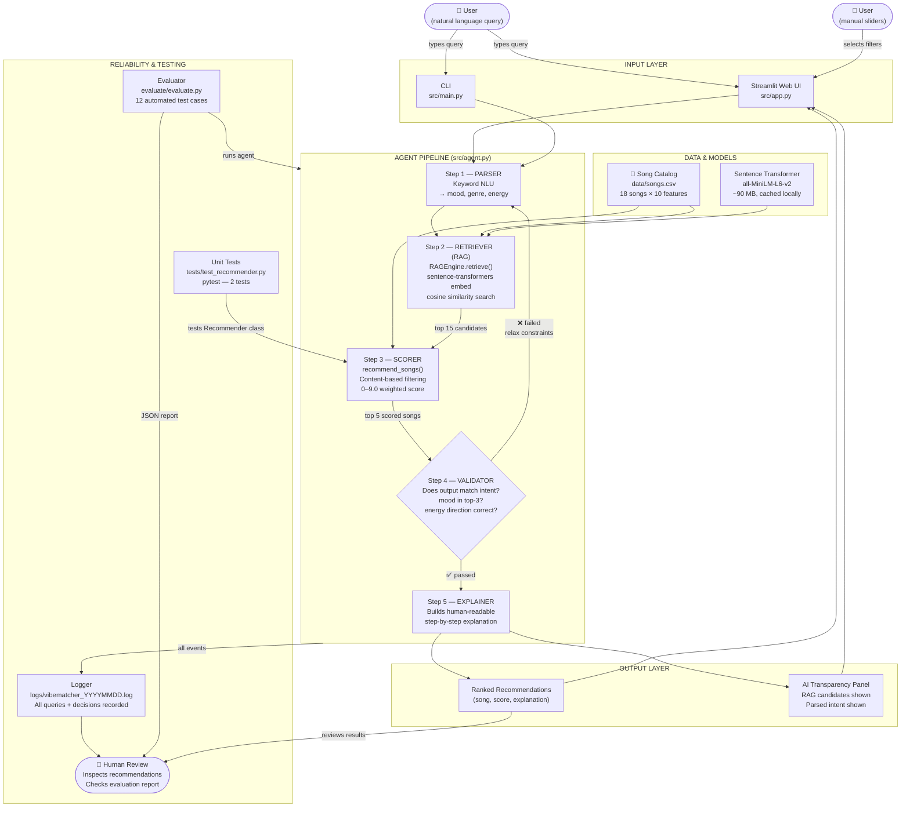

# VibeMatcher AI — System Design & Architecture

## High-Level Data Flow



---

## Plain-Text Diagram (ASCII)

```
┌─────────────────────────────────────────────────────────────────────┐
│                         INPUT LAYER                                 │
│                                                                     │
│   👤 User types:  "chill lofi for studying"                        │
│         │                                                           │
│   ┌─────▼──────────────────────────────────────────────────────┐   │
│   │  Streamlit Web UI (src/app.py)  OR  CLI (src/main.py)      │   │
│   └─────────────────────────┬──────────────────────────────────┘   │
└─────────────────────────────│───────────────────────────────────────┘
                              │
┌─────────────────────────────▼───────────────────────────────────────┐
│                    AGENT PIPELINE  (src/agent.py)                   │
│                                                                     │
│  ┌──────────────────────────────────────────────────────────────┐   │
│  │  STEP 1 — PARSER                                             │   │
│  │  Keyword NLU: detects mood=chill, genre=lofi, energy=0.2    │   │
│  └──────────────────────────┬───────────────────────────────────┘   │
│                             │                                       │
│  ┌──────────────────────────▼───────────────────────────────────┐   │
│  │  STEP 2 — RETRIEVER  (RAG)    ◄─── data/songs.csv           │   │
│  │  RAGEngine embeds query with sentence-transformers           │   │
│  │  Finds 15 most semantically similar songs                   │   │
│  │  (all-MiniLM-L6-v2 model, runs locally, no API needed)      │   │
│  └──────────────────────────┬───────────────────────────────────┘   │
│                             │  15 candidates                        │
│  ┌──────────────────────────▼───────────────────────────────────┐   │
│  │  STEP 3 — SCORER  (src/recommender.py)                      │   │
│  │  Content-based scoring on those candidates only             │   │
│  │  genre(+1.5) + mood(+2.0) + energy(0–4.0) + valence(+1.0)  │   │
│  │  Returns top 5 with per-song explanations                   │   │
│  └──────────────────────────┬───────────────────────────────────┘   │
│                             │  top 5 results                        │
│  ┌──────────────────────────▼───────────────────────────────────┐   │
│  │  STEP 4 — VALIDATOR  (self-check)                           │   │
│  │  Does mood appear in top 3?  ──── YES ──────────────────┐   │   │
│  │  Does energy direction match?          │                 │   │   │
│  │       NO → relax constraints           │                 │   │   │
│  │       → retry (up to 3 iterations) ───►│                 │   │   │
│  └────────────────────────────────────────│─────────────────┘   │   │
│                                           │                         │
│  ┌────────────────────────────────────────▼─────────────────────┐   │
│  │  STEP 5 — EXPLAINER                                          │   │
│  │  Builds plain-English explanation of the full process       │   │
│  └──────────────────────────────────────────────────────────────┘   │
└─────────────────────────────┬───────────────────────────────────────┘
                              │
┌─────────────────────────────▼───────────────────────────────────────┐
│                         OUTPUT LAYER                                │
│                                                                     │
│   Ranked Recommendations (song, score, explanation)                │
│   + Transparency panel: RAG candidates, parsed intent              │
│                                                                     │
│   👤 Human reviews results in UI or terminal                       │
└─────────────────────────────────────────────────────────────────────┘

┌─────────────────────────────────────────────────────────────────────┐
│                  RELIABILITY & TESTING LAYER                        │
│                                                                     │
│  ┌───────────────────┐   ┌────────────────────┐   ┌─────────────┐  │
│  │  Unit Tests       │   │  Evaluator         │   │  Logger     │  │
│  │  pytest           │   │  evaluate.py       │   │  logs/*.log │  │
│  │  2 test cases     │   │  12 test cases     │   │             │  │
│  │  - sort order     │   │  - relevance       │   │  Records:   │  │
│  │  - explanations   │   │  - consistency     │   │  - queries  │  │
│  │                   │   │  - edge cases      │   │  - RAG hits │  │
│  │  tests Scorer     │   │  Saves JSON report │   │  - scores   │  │
│  └───────────────────┘   └─────────┬──────────┘   │  - retries  │  │
│                                    │              └──────┬──────┘  │
│                                    └──────────────────── │         │
│                                                          ▼         │
│                                                   👤 Human Review  │
│                                              (reads reports/logs)  │
└─────────────────────────────────────────────────────────────────────┘
```

---

## Component Summary

| Component | File | Role |
|-----------|------|------|
| **Web UI** | `src/app.py` | User-facing Streamlit interface |
| **CLI** | `src/main.py` | Terminal interface (interactive or one-shot) |
| **Parser** | `src/agent.py` → `parse_query()` | Extracts structured intent from natural language |
| **Retriever (RAG)** | `src/rag_engine.py` | Semantic search over song catalog using local embeddings |
| **Scorer** | `src/recommender.py` | Content-based weighted scoring of retrieved candidates |
| **Validator** | `src/agent.py` → `_validate()` | Self-checks output; triggers retry loop if needed |
| **Explainer** | `src/agent.py` → `_build_explanation()` | Generates step-by-step explanation of the process |
| **Logger** | `src/logger_config.py` | Writes all decisions to `logs/` for traceability |
| **Unit Tests** | `tests/test_recommender.py` | Verifies scorer correctness with pytest |
| **Evaluator** | `evaluate/evaluate.py` | Runs 12 automated reliability tests; saves JSON report |

## Where Humans Are Involved

1. **At input** — the user writes the query in natural language
2. **At output** — the user reads recommendations and the transparency panel
3. **In testing** — a developer runs `pytest` and `python -m evaluate.evaluate`, then reads the printed report and JSON log to judge whether AI behavior is acceptable
4. **In logging review** — `logs/vibematcher_YYYYMMDD.log` gives a full audit trail of every query and decision the system made
